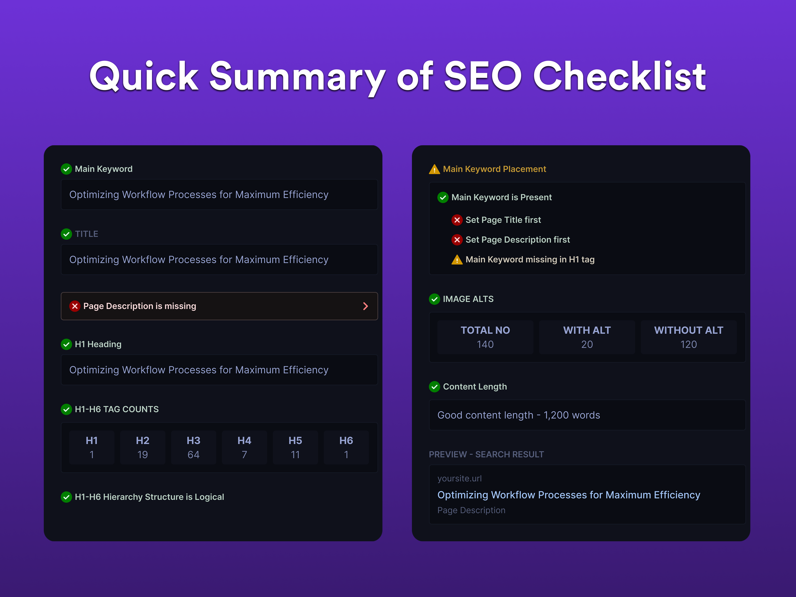
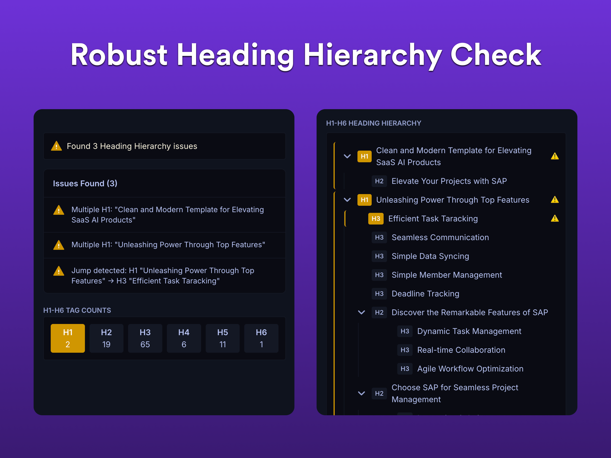
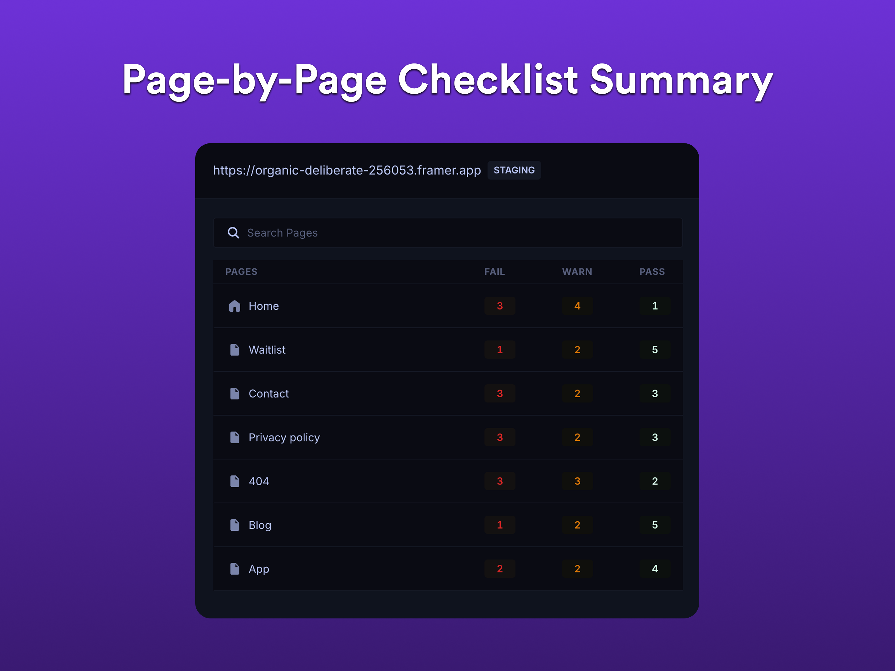

# First Rank Pro - SEO Analysis Plugin for Framer

A comprehensive SEO analysis tool for Framer websites that helps you optimize your pages for search engines.

## Screenshots

**Quick Summary of SEO Checklist** — at-a-glance status for keyword, title, description, H1, heading counts, keyword placement, image alts, content length, and a SERP preview:

**Robust Heading Hierarchy Check** — flags multiple H1s and level jumps, with a full H1–H6 outline:

**Alt Text, SEO Coaching & SERP Preview** — per-image alt-text editing, good-vs-bad guidance, and a live search-result preview:

**Page-by-Page Checklist Summary** — pass / warning / fail counts across every page in your site:

## Features

### Current Features
- **SEO Score Calculation** - Overall page health score
- **Title Analysis** - Length and keyword optimization checks
- **Meta Description Analysis** - Character count and keyword presence
- **Heading Hierarchy Validation** - Proper H1-H6 structure analysis
- **Content Word Count** - Track content depth
- **Image Alt Text Detection** - Identify images missing alt text
- **Keyword Placement Analysis** - Check keyword distribution
- **Internal/External Link Analysis** - Link structure insights
- **Search Preview** - See how your page appears in Google search results
- **Quick Summary Dashboard** - At-a-glance SEO health overview

### Coming Soon
- AI-powered suggestions for page titles
- AI-powered suggestions for meta descriptions
- AI-powered suggestions for H1 headings
- AI-powered alt text generation for images
- Focus keyword suggestions

## Installation

1. Open your Framer project
2. Go to Plugins in the left sidebar
3. Search for "First Rank Pro"
4. Click Install

## Usage

1. Open the plugin from the Framer plugins panel
2. Select a page from your site to analyze
3. Set a focus keyword (optional but recommended)
4. Review the SEO analysis and recommendations
5. Make improvements in Framer based on the suggestions

## Support

For issues or feature requests, please contact support.

## Version

0.1.0 - Initial release

## License

[MIT](LICENSE) — free to use, modify, and distribute.
